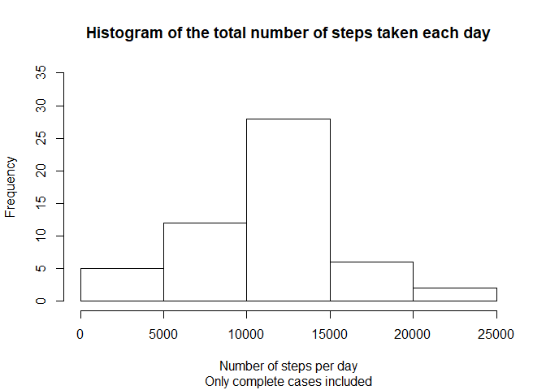
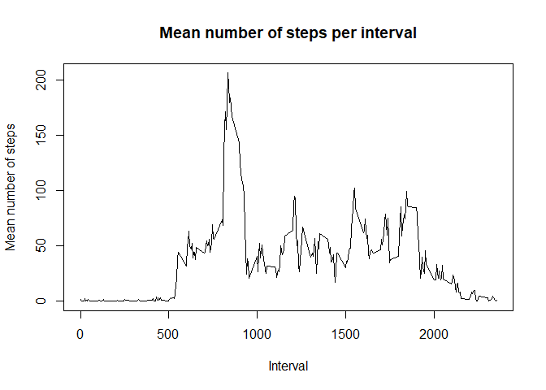
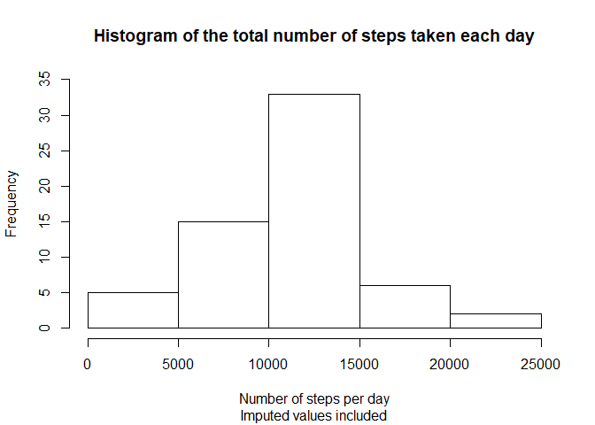
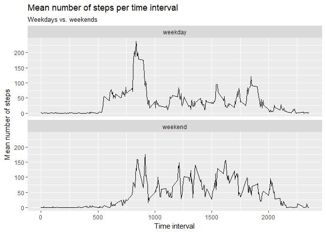

# Introduction

It is now possible to collect a large amount of data about personal movement using activity monitoring devices. This assignment makes use of data from a personal activity monitoring device. This device collects data at 5 minute intervals through out the day. The data consists of two months of data from an anonymous individual collected during the months of October and November, 2012 and include the number of steps taken in 5 minute intervals each day.  
  
The variables included in this dataset are:  
  
**steps:** Number of steps taking in a 5-minute interval (missing values are coded as \color{red}{\verb|NA|}NA)  
**date:** The date on which the measurement was taken in YYYY-MM-DD format  
**interval:** Identifier for the 5-minute interval in which measurement was taken  
The dataset is stored in a comma-separated-value (CSV) file and there are a total of 17,568 observations in this dataset.  
  
# The submission contains  
  
1. Code for reading in the dataset and/or processing the data  
2. Histogram of the total number of steps taken each day  
3. Mean and median number of steps taken each day  
4. Time series plot of the average number of steps taken  
5. The 5-minute interval that, on average, contains the maximum number of steps  
6. Code to describe and show a strategy for imputing missing data  
7. Histogram of the total number of steps taken each day after missing values are imputed  
8. Panel plot comparing the average number of steps taken per 5-minute interval across weekdays and weekends  
9. All of the R code needed to reproduce the results (numbers, plots, etc.) in the report  

## Loading and preprocessing the data  

Download the data into the working directory, readt it to the memory and transform into usable format.  

### 1. Load the data  

```r
library(ggplot2)
```


```r
#set the download link and download the data file
if(!file.exists("./activity.csv")) {
    fileUrl <- "https://d396qusza40orc.cloudfront.net/repdata%2Fdata%2Factivity.zip"
    download.file(fileUrl, destfile = "./activity.zip")
    
    #unzip the data
    unzip(zipfile = "./activity.zip", exdir = ".")}

#read activity dataframe into the memory
activity <- read.csv("activity.csv",colClasses = c("numeric","Date","integer"))
head(activity)
```

```
##   steps       date interval
## 1    NA 2012-10-01        0
## 2    NA 2012-10-01        5
## 3    NA 2012-10-01       10
## 4    NA 2012-10-01       15
## 5    NA 2012-10-01       20
## 6    NA 2012-10-01       25
```

### 2. Process/transform the data into a format suitable for the analyses  

```r
#for each date determine the day of the week, save it as ordered factor variable, determine if the date is a Saturday or Sunday and save it to a variable Weekend
activity$weekday <- weekdays(activity[,2])
activity$weekday <- factor(activity$weekday, levels = c("Monday", "Tuesday", "Wednesday", "Thursday", "Friday", "Saturday", "Sunday"), ordered = TRUE)
activity$weekend <- activity$weekday=="Saturday" | activity$weekday=="Sunday"
activity$weekend <- ifelse(activity$weekend==T,"weekend","weekday")
activity$weekend <- factor(activity$weekend, levels = c("weekday", "weekend"), ordered = TRUE)
head(activity)
```

```
##   steps       date interval weekday weekend
## 1    NA 2012-10-01        0  Monday weekday
## 2    NA 2012-10-01        5  Monday weekday
## 3    NA 2012-10-01       10  Monday weekday
## 4    NA 2012-10-01       15  Monday weekday
## 5    NA 2012-10-01       20  Monday weekday
## 6    NA 2012-10-01       25  Monday weekday
```

```r
#filter out only complete cases of activity dataframe rows
cpactivity <- activity[complete.cases(activity),]
head(cpactivity)
```

```
##     steps       date interval weekday weekend
## 289     0 2012-10-02        0 Tuesday weekday
## 290     0 2012-10-02        5 Tuesday weekday
## 291     0 2012-10-02       10 Tuesday weekday
## 292     0 2012-10-02       15 Tuesday weekday
## 293     0 2012-10-02       20 Tuesday weekday
## 294     0 2012-10-02       25 Tuesday weekday
```
## What is mean total number of steps taken per day?  

### 1. Make a histogram of the total number of steps taken each day  
Calculate total sums of steps for each day, name the columns and make a histogram of the total number of steps taken each day.  

```r
tsteps_byday <- aggregate(cpactivity$steps, by=list(date=cpactivity$date), FUN=sum)
colnames(tsteps_byday) <- c("date", "total_steps")
```


```r
hist(tsteps_byday$total_steps,main = "Histogram of the total number of steps taken each day", sub = "Only complete cases included", xlab = "Number of steps per day", ylim = c(0,35))
```

<!-- -->

### 2. Calculate and report the mean and median total number of steps taken per day.  


```r
mean_median <- summary(tsteps_byday$total_steps)[3:4]
```

The mean total number of steps taken per day was 10766.19.  
The median total number of steps taken per day was 10765.  


## What is the average daily activity pattern?  

### 1. Make a time series plot (i.e. type = "l") of the 5-minute interval (x-axis) and the average number of steps taken, averaged across all days (y-axis)  

Average the number of steps taken per interval across all days, name the columns and make a linear time series plot  

```r
msteps_byinterval <- aggregate(cpactivity$steps, by=list(interval=cpactivity$interval), FUN=mean)
colnames(msteps_byinterval) <- c("interval", "mean_steps")
head(msteps_byinterval)
```

```
##   interval mean_steps
## 1        0      1.717
## 2        5      0.340
## 3       10      0.132
## 4       15      0.151
## 5       20      0.075
## 6       25      2.094
```

```r
plot(msteps_byinterval$interval,msteps_byinterval$mean_steps,type = 'l', main = "Mean number of steps per interval",xlab = "Interval",ylab = "Mean number of steps")
```

<!-- -->

### 2. Which 5-minute interval, on average across all the days in the dataset, contains the maximum number of steps?  
Identify the time interval in which, on average, the number of steps was maximal and determine the maximal average number of steps.  

```r
max_steps_interval <- msteps_byinterval[msteps_byinterval$mean_steps == max(msteps_byinterval$mean_steps),]
```

The time interval that, on average, contained the maximum number of steps, was 835 and the number of steps in this interval was, on average, 206.17.  

## Imputing missing values  

### 1. Calculate and report the total number of missing values in the dataset (i.e. the total number of rows with NAs)  


```r
sum_na <- sum(is.na(activity$steps))
mean_na <- mean(is.na(activity$steps))
```

The total number of missing values in the activity dataset was 2304 out of 17568 (13.11%).

### 2. Devise a strategy for filling in all of the missing values in the dataset.  
Calculate mean number of steps for each time interval on a given weekday and save it into a dataframe.  

```r
means_for_imputation <- aggregate(steps ~ interval + weekday, cpactivity, mean)
head(means_for_imputation)
```

```
##   interval weekday steps
## 1        0  Monday   1.4
## 2        5  Monday   0.0
## 3       10  Monday   0.0
## 4       15  Monday   0.0
## 5       20  Monday   0.0
## 6       25  Monday   5.0
```
### 3. Create a new dataset that is equal to the original dataset but with the missing data filled in.
Copy data frame activity into newactivity and impute new steps values in places of former NAs.
The imputed steps are now mean steps taken on a given time interval on a given day of a week. For instance, a missing value on a Wednesday 1555 interval is replaced by mean number of steps taken on other Wednesdays at 15.55.

```r
newactivity <- data.frame(activity)
newactivity$steps <- ifelse(is.na(newactivity$steps) == TRUE, means_for_imputation$steps[(means_for_imputation$interval %in% newactivity$interval)&&(means_for_imputation$weekday %in% newactivity$weekday)], newactivity$steps)
head(newactivity)
```

```
##   steps       date interval weekday weekend
## 1   1.4 2012-10-01        0  Monday weekday
## 2   0.0 2012-10-01        5  Monday weekday
## 3   0.0 2012-10-01       10  Monday weekday
## 4   0.0 2012-10-01       15  Monday weekday
## 5   0.0 2012-10-01       20  Monday weekday
## 6   5.0 2012-10-01       25  Monday weekday
```
### 4. Make a histogram of the total number of steps taken each day and Calculate and report the mean and median total number of steps taken per day.  
For the newactivity data frame calculate total sums of steps for each day, name the columns and make a histogram of the total number of steps taken each day.  

```r
imp_tsteps_byday <- aggregate(newactivity$steps, by=list(date=newactivity$date), FUN=sum)
colnames(imp_tsteps_byday) <- c("date", "total_steps")
```

```r
hist(imp_tsteps_byday$total_steps,main = "Histogram of the total number of steps taken each day",sub = "Imputed values included",xlab = "Number of steps per day",ylim = c(0,35))
```

<!-- -->
  
Calculate and report the mean and median total number of steps taken per day.  

```r
imp_mean_median <- summary(imp_tsteps_byday$total_steps)[3:4]
```

The **mean** total number of steps taken per day **in the data frame without imputation** was 10766.19.  
The **mean** total number of steps taken per day **in the dataframe with imputed values** was 10821.21.  
The **median** total number of steps taken per day **in the data frame without imputation** was 10765.  
The **median** total number of steps taken per day **in the dataframe with imputed values** was 11015. 
  
Imputing missing data changed the former estimates of the total daily number of steps by **increasing them slightly**.  

## Are there differences in activity patterns between weekdays and weekends?  
The factor variable in the dataset with two levels - "weekday" and "weekend", indicating whether a given date is a weekday or weekend day, was already created earlier. The dataset with the filled-in missing values already contains this variable.  
  

```r
head(newactivity)
```

```
##   steps       date interval weekday weekend
## 1   1.4 2012-10-01        0  Monday weekday
## 2   0.0 2012-10-01        5  Monday weekday
## 3   0.0 2012-10-01       10  Monday weekday
## 4   0.0 2012-10-01       15  Monday weekday
## 5   0.0 2012-10-01       20  Monday weekday
## 6   5.0 2012-10-01       25  Monday weekday
```
### Make a panel plot containing a time series plot (i.e. type = "l") of the 5-minute interval (x-axis) and the average number of steps taken, averaged across all weekday days or weekend days (y-axis).  


```r
weekday_weekend_msteps_byinterval <- aggregate(steps ~ interval + weekend, newactivity, mean)
colnames(weekday_weekend_msteps_byinterval) <- c("interval", "weekday_or_weekend", "mean_steps")
head(weekday_weekend_msteps_byinterval)
```

```
##   interval weekday_or_weekend mean_steps
## 1        0            weekday      2.311
## 2        5            weekday      0.450
## 3       10            weekday      0.175
## 4       15            weekday      0.200
## 5       20            weekday      0.089
## 6       25            weekday      1.564
```

```r
weekday_weekend_plot <- ggplot() + geom_line(aes(y=mean_steps, x=interval), data = weekday_weekend_msteps_byinterval) + facet_wrap( ~ weekday_or_weekend, nrow = 2) + theme(legend.position = "none") +  ggtitle("Mean number of steps per time interval", subtitle = "Weekdays vs. weekends") + xlab("Time interval") + ylab("Mean number of steps")
weekday_weekend_plot
```

<!-- -->
